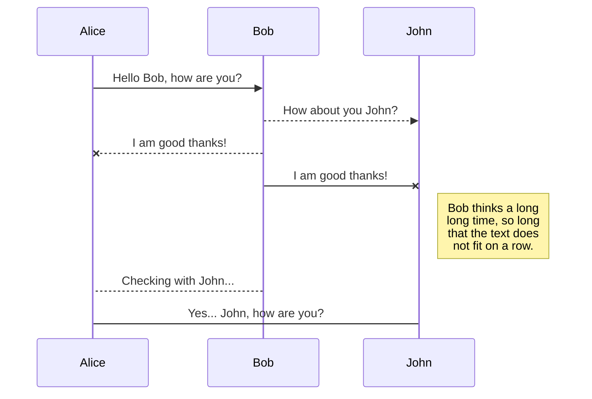
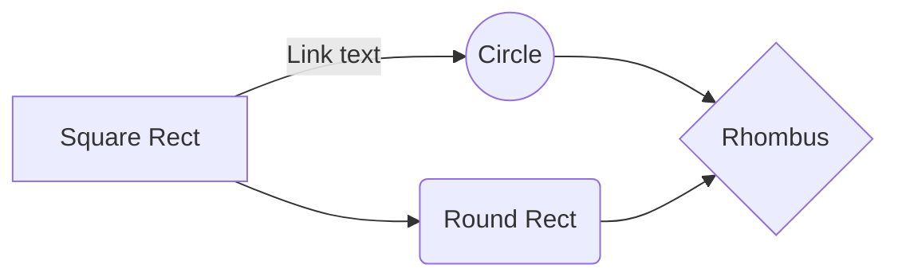

# Internal message server API
  
## Overview
This paper is to describe to internal message server API for transmitting messages to messaging vendor like Kakao, SKT. Internal message server (IMS, below) API allows docker network access because it just is for **internal uses**. This server treats string format input data and uses **GET, POST** methods. So, JSON parsing is needed.

## Terminology
- Internal message server(IMS): This server is server for sending message. However, there is proxy server in front of it. **Internal** is meaning that. Client connects proxy server and sending data(string format), then, proxy server bypass it to IMS. IMS treats actually data to be available for sending vendor(e.g. Kakao).  

- Alimtalk:

- Friendtalk:

## Prerequisiteq

## API specification
### Host
[develop] http://localhost:9090/  
[operation] http://localhost:9091/  

### Request for sending alimtalk to Kakao
[Reqeust]  
- path: /v1/IMS/kakao-atalk/sendMessage  
- method: POST  
- header:  
- client timeout:  60
- parameters  

| key | type | required | description | example |
|-----|------|----------|-------------|---------|
| message_type | text(2) | N | The type of message | "message_type":"AT" |
| serial_no | text(30) | Y | Message serial number | "serial_no":"12345678" |
| sender_key | text(40) | Y | Sender key for Kakao | "sender_key":"1234abcd6789efgh1011ijkl1213mnop" |
| phone_number | text(16) | N | User phone number (include national code) | "sender_key":"821011112222" |
| app_user_id | text(20) | N | App user id for Kakao (There must be either phone_number or app_user_id) | "app_user_id":"12345" |
| template_code | text(30) | Y | Alimtalk template code (Actual message type and it have to be registered) | "template_code":"A001_01" |
| message | text(1000) | Y | Message to user (Limit 1000 include white space) | "message":"Your package may be delivered at 10." |
| title | text(50) | N | Key word in template | "title":"delivered at 10." |
| response_method | text(8) | Y | Method for getting result (Three types; realtime, push(recommand), and polling. No default value) | "response_method":"push" |
| timeout | number | N | Timeout for judge success | "timeout":30 |
| attachment | json | N | Attachment for message like link button. | "attachment": {"button": [{"type": "AL","name": "문의내역 확인하기","url_mobile": "","url_pc": "","scheme_android": "daumapps://open","scheme_ios": "daumapps://open"}]} |
| channel_key | text(20) | N | (only polling) Send message by channel. If there was no channel key, results could be taken by channel registered the user's sender key | "channel_key":"test" |

[Respose]
- header:  
- parameters  

| key | type | required | description | example |
|-----|------|----------|-------------|---------|
| code | text(4) | Y | The result of sending | "code":"0000" |
| received_at | text(19) | N | The time of receiving message. However not sending time | "received_at":"2020-01-01 10:10" |
| message | text | N | Error message  (if there was error) | "message":"AckTimeoutException" |

### Request for sending friendtalk to Kakao
[Reqeust]  
- path: /v1/IMS/kakao-ftalk/sendMessage  
- method: POST  
- header:  
- client timeout:  60
- parameters  

| key | type | required | description | example |
|-----|------|----------|-------------|---------|
| message_type | text(2) | N | The type of message (FT: friendtalk) | "message_type":"FT" |
| serial_no | text(30) | Y | Message serial number | "serial_no":"12345678" |
| sender_key | text(40) | Y | Sender key for Kakao | "sender_key":"1234abcd6789efgh1011ijkl1213mnop" |
| phone_number | text(16) | N | User phone number (include national code) | "sender_key":"821011112222" |
| app_user_id | text(20) | N | App user id for Kakao (There must be either phone_number or app_user_id) | "app_user_id":"12345" |
| message | text(1000) | Y | Message to user (Limit 1000 include white space) | "message":"Your package may be delivered at 10." |
| ad_flag | text(1) | N | Required message revealation flag (default: N, use or not: Y/N) | "ad_flag":"N" |
| wide | text(1) | N | Wide bubble use flag (default: N, use or not: Y/N) | "wide":"N" |
| attachment | json | N | Attachment for message like link button. | "attachment": {"button": [{"type": "AL","name": "문의내역 확인하기","url_mobile": "","url_pc": "","scheme_android": "daumapps://open","scheme_ios": "daumapps://open"}]} |

[Respose]
- header:  
- parameters  

| key | type | required | description | example |
|-----|------|----------|-------------|---------|
| code | text(4) | Y | The result of sending | "code":"0000" |
| message | text | N | Error message  (if there was error) | "message":"AckTimeoutException" |

### Request for sending message to MMS
[Reqeust]  
- path: /v1/IMS/mms/sendMessage  
- method: POST  
- header:  
- client timeout:  60
- parameters  

| key | type | required | description | example |
|-----|------|----------|-------------|---------|
| serial_no | text(30) | Y | Message serial number | "serial_no":"12345678" |
| phone_number | text(16) | N | User phone number | "sender_key":"821011112222" |

[Respose]
- header:  
- parameters  

| key | type | required | description | example |
|-----|------|----------|-------------|---------|
| code | text(4) | Y | The result of sending | "code":"0000" |
| received_at | text(19) | N | The time of receiving message. However not sending time | "received_at":"2020-01-01 10:10" |
| message | text | N | Error message  (if there was error) | "message":"AckTimeoutException" |

### Request for sending message to SMS
[Reqeust]  
- path: /v1/IMS/sms/sendMessage  
- method: POST  
- header:  
- client timeout:  60
- parameters  

| key | type | required | description | example |
|-----|------|----------|-------------|---------|
| serial_no | text(30) | Y | Message serial number | "serial_no":"12345678" |
| phone_number | text(16) | N | User phone number | "sender_key":"821011112222" |

[Respose]
- header:  
- parameters  

| key | type | required | description | example |
|-----|------|----------|-------------|---------|
| code | text(4) | Y | The result of sending | "code":"0000" |
| received_at | text(19) | N | The time of receiving message. However not sending time | "received_at":"2020-01-01 10:10" |
| message | text | N | Error message  (if there was error) | "message":"AckTimeoutException" |

## Code definition
### Error codes
| code |  message |   description   |
|------|----------|-----------------|
|0000| `No message` | Success |
|9999| `Unknown error` | System error |

## Test

## markdown Example
  > Before starting to sync files, you must link an account in the **Synchronize** sub-menu.

[Handlebars templates](http://handlebarsjs.com/)

And this will produce a flow chart:

